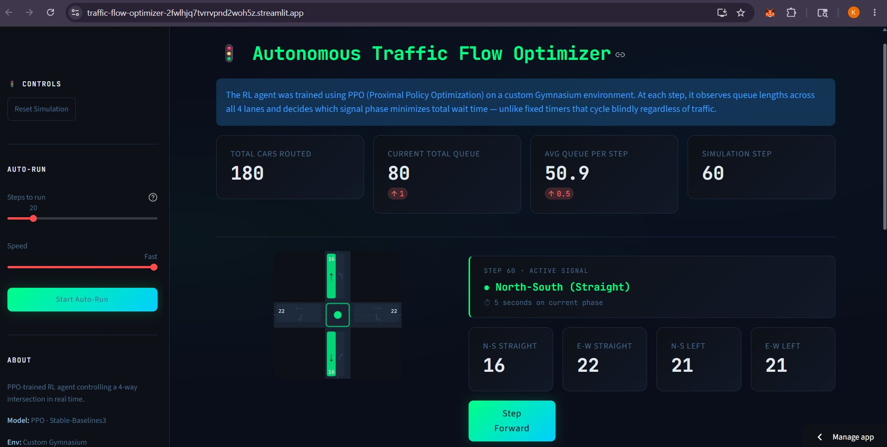
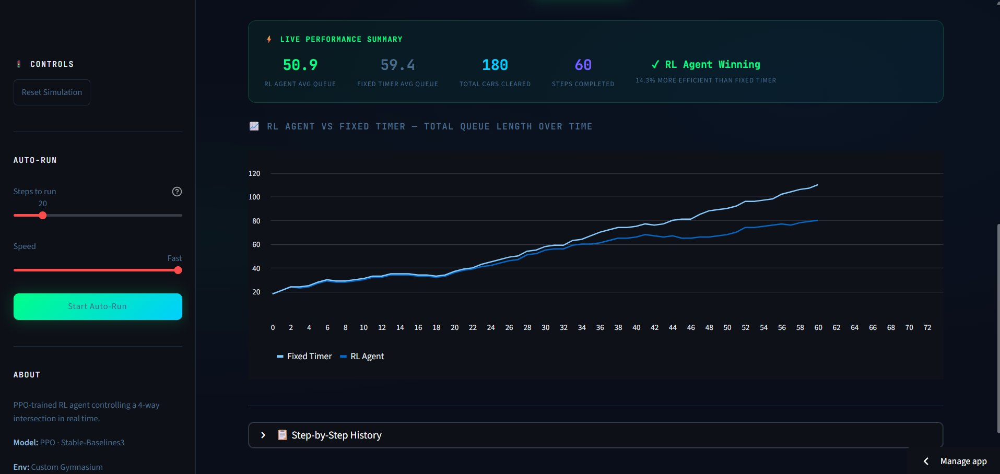
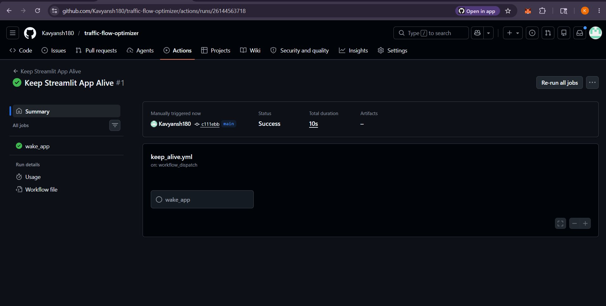

# 🚦 Autonomous Traffic Flow Optimizer

Real-world traffic signals run on fixed timers — green for 30 seconds, red for 30 seconds, regardless of actual traffic. This wastes time and causes unnecessary congestion.

This project trains a **PPO Reinforcement Learning agent** on a custom Gymnasium simulation to fix that. The agent observes queue lengths across all 4 lanes in real time and decides which signal phase to activate — learning through 200,000 timesteps of trial and error to minimize total vehicle wait time. At 60 steps it achieves **14.3% lower queue lengths**(depends on live data) than a fixed-timer baseline. 

Departure rate: 3 cars/step (≈ 1800 vehicles/hour — real-world saturation flow)

Run around 40+ steps for the RL advantage to become statistically significant and then scroll down to see performance summary and comparison chart

**[→ Live Demo](https://traffic-flow-optimizer-2fwlhjq7tvrrvpnd2woh5z.streamlit.app/)**

---



---

## Results



| Metric | RL Agent | Fixed Timer |
|--------|----------|-------------|
| Avg Queue Per Step | 50.9 | 59.4 |
| Efficiency | **14.3% better** | baseline |
| Phase Distribution | Balanced (all 4 phases) | Fixed cycle |
| Total Cars Routed | 180 | — |

---

## What it does

Real-world traffic signals run on fixed timers regardless of actual traffic. This project trains a **PPO Reinforcement Learning agent** on a custom Gymnasium simulation to make smarter decisions — observing queue lengths across all 4 lanes every step and selecting which signal phase minimizes total wait time.

---

## Architecture

```
Streamlit Frontend  →  API Gateway  →  AWS Lambda (FastAPI + Docker)
                                              ↓
                                    PPO Model (baked in ECR image)
                                              ↓
                                    AWS CloudWatch (monitoring)

GitHub Actions → keep_alive.yml (pings app every 8hrs)
```

---

## Tech Stack

| Layer | Tech |
|-------|------|
| RL Algorithm | PPO — Stable-Baselines3 |
| Environment | Custom Gymnasium |
| Experiment Tracking | MLflow |
| Inference | FastAPI + Mangum |
| Containerization | Docker |
| Container Registry | AWS ECR |
| Serverless Deploy | AWS Lambda |
| Monitoring | AWS CloudWatch |
| Frontend | Streamlit |
| Hosting | Streamlit Community Cloud |
| CI/CD | GitHub Actions |
| Language | Python 3.10 |
---

## Project Structure

```
├── env/               # Custom Gymnasium environment
├── training/          # PPO training + MLflow tracking
├── inference/         # FastAPI app + Dockerfile
├── frontend/          # Streamlit dashboard
├── baseline/          # Fixed-timer baseline
└── .github/workflows/ # keep_alive + deploy pipelines
```

---

## Key Design Decisions

**PPO over DQN** — More stable with noisy reward signals, converged faster, better phase balance.

**Lambda over EC2** — Inference is stateless and bursty. Lambda costs zero when idle vs EC2 running 24/7.

**Model in Docker image** — Simplifies architecture and reduces cold start time for demo scale. Production would separate via S3.

**Poisson arrivals** — Real traffic follows Poisson distribution. Tuned λ=0.8 (main lanes), λ=0.3 (turn lanes) to make the environment actually solvable.

---

## Validation Results

```
Phase 0 (N-S Straight):   36.0% ✅
Phase 1 (E-W Straight):   35.5% ✅
Phase 2 (N-S Left Turn):  13.8% ✅
Phase 3 (E-W Left Turn):  14.7% ✅
```
All 4 phases selected — no lane starvation.

---

## GitHub Actions



`keep_alive.yml` pings the Streamlit app every 8 hours to prevent sleep.

---

## Quick Start

```bash
git clone https://github.com/Kavyansh180/traffic-flow-optimizer.git
cd traffic-flow-optimizer
python -m venv venv && venv\Scripts\activate
pip install -r requirements.txt

# Train
python -m training.train

# Run frontend
cd frontend && streamlit run streamlit_app.py
```

---

**Author:** [Kavyansh Vats](https://github.com/Kavyansh180)
